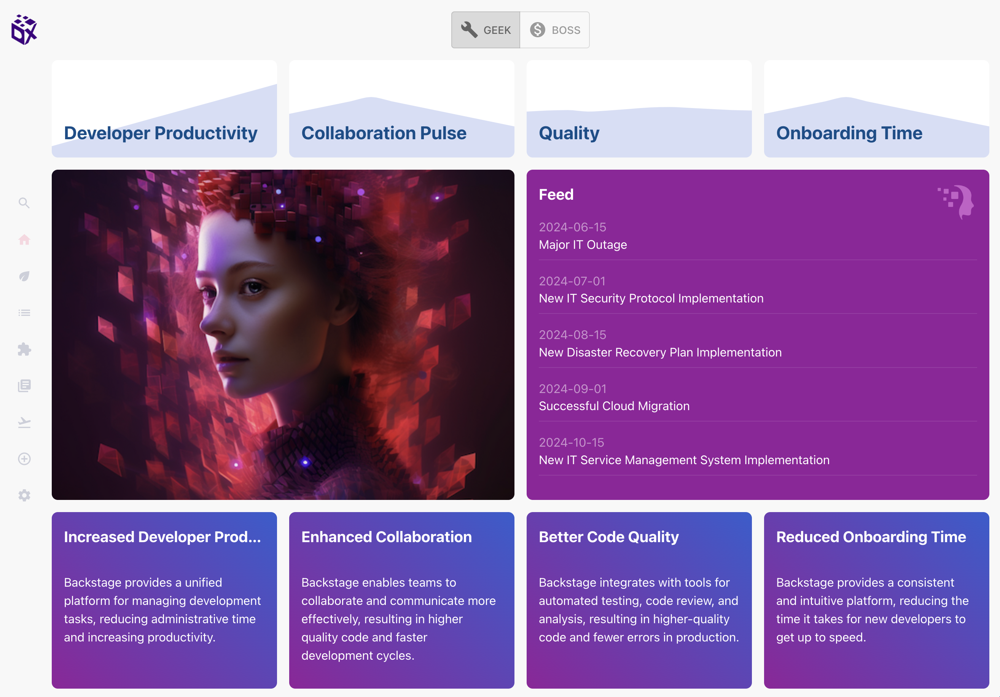

# Welcome to DX Hub

## TL;DR

The quickest way to experiment is to use our Docker image. After that, if you want to customize DX Hub to your context, you will need a Node.js environment and run DX Hub with `yarn`.

- [fork](https://github.com/AvaliaSystems/dx-hub/fork) this repo
- `git clone https://github.com/your-org/dx-hub`
- `cd dx-hub`
- `touch dx-hub/app-config.local.yaml`
- `docker-compose up`
- open [`http://localhost:1407`](http://localhost:1407)

More information in the [documentation](./docs/index.md), and in particular in the ["first steps with Docker"](./docs/first-steps-with-docker.md) page.

.
