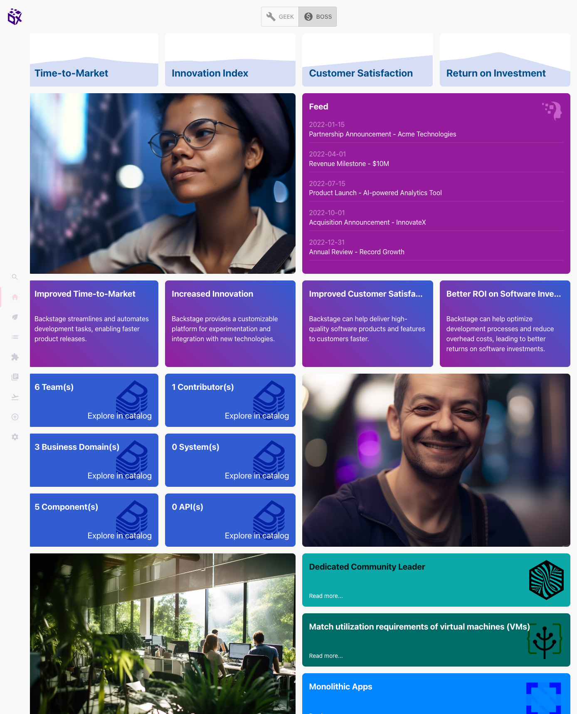
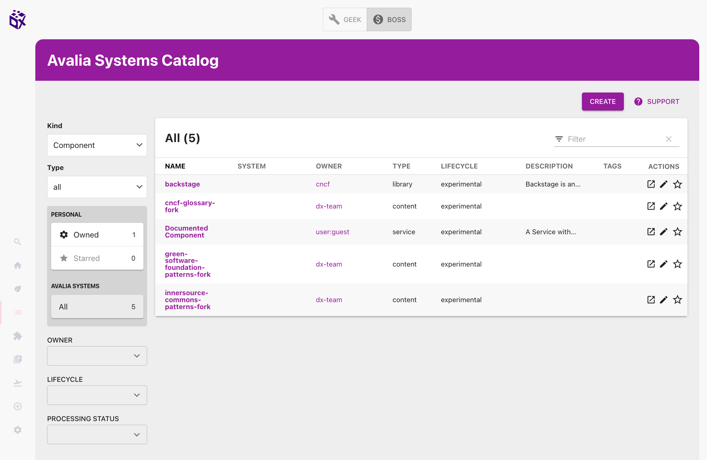

# DX Hub: ignite your Backstage Developer Portal

[Backstage](https://backstage.io/) is a powerful platform for building developer portals and improve developer experience across your teams. However, it comes with a learning curve and the first steps can feel a bit overwhelming.

The goal of this repo is to **speed up the discovery process**, and to provide a foundation for building your developer portal. We want to enable you to quickly experiment and demo the potential of Developer Portals in your organization.

**DX Hub** provides you with a pre-configured Backstage instance, with a collection of pages, plugins and content that provide a richer experience than the standard skeleton.

.

.

## How did we build it?

To create DX Hub Ignite, we have:

* followed the [standard process](https://backstage.io/docs/getting-started/) to create a new Backstage instance.
* extended the standard UI with content pages, with a focus on content and personalization
* created visual components to populate these pages
* populated the catalog with some example entities

